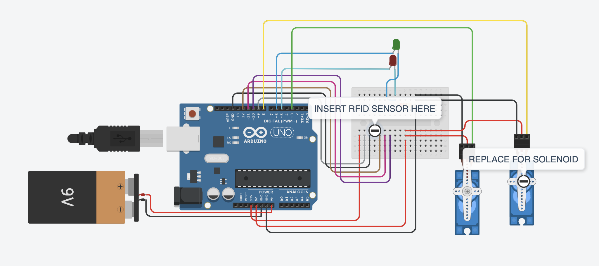

**RFID Lockbox**

A normal safe uses a combination lock; the RFID Lockbox uses an RFID tag sensor and tag instead to control the lock. The project you will see below uses this mechanism to unlock and lock the safe through a solenoid, which, in simple terms, is a magnet that can be turned off and on; the RFID tag is inserted into a slot where it is read by the RFID tag sensor, and if it isn't the correct tag, then it will be kept in the safe. If the correct tag is inserted and read, then it will turn the solenoid off and thus allow the user to open the safe to retrieve or place their valuables inside. 

| **Engineer** | **School** | **Area of Interest** | **Grade** |
|:--:|:--:|:--:|:--:|
| Xinkun L. | Canyon Crest Academy | Electrical Engineering | Incoming Junior

**Replace the BlueStamp logo below with an image of yourself and your completed project. Follow the guide [here](https://tomcam.github.io/least-github-pages/adding-images-github-pages-site.html) if you need help.**


  
# Final Milestone

**Don't forget to replace the text below with the embedding for your milestone video. Go to Youtube, click Share -> Embed, and copy and paste the code to replace what's below.**

<iframe width="560" height="315" src="https://www.youtube.com/embed/F7M7imOVGug" title="YouTube video player" frameborder="0" allow="accelerometer; autoplay; clipboard-write; encrypted-media; gyroscope; picture-in-picture; web-share" allowfullscreen></iframe>

For your final milestone, explain the outcome of your project. Key details to include are:
- What you've accomplished since your previous milestone
- What your biggest challenges and triumphs were at BSE
- A summary of key topics you learned about
- What you hope to learn in the future after everything you've learned at BSE


# Second Milestone

**Don't forget to replace the text below with the embedding for your milestone video. Go to Youtube, click Share -> Embed, and copy and paste the code to replace what's below.**

<iframe width="560" height="315" src="https://www.youtube.com/embed/y3VAmNlER5Y" title="YouTube video player" frameborder="0" allow="accelerometer; autoplay; clipboard-write; encrypted-media; gyroscope; picture-in-picture; web-share" allowfullscreen></iframe>

My goal for the second milestone was finishing the base project/combining the circuit with the physical lockbox. I was able to make the lockbox, fit all the wiring inside it, and get it working, while also making preparations for my future modifications. During the completion of this, I had to face damaged batteries from miswiring, modifying my lock due to it not working as intended, and many other issues. But through working through them, I was able to improve my ability to use my materials in unique ways to solve problems, and was able to learn how to debug my wiring and test it to make sure it works. During the time of creating the circuit, the lockbox, and combining them, what surprised me the most was how much the finished product ended up being compared to what I had thought of in the beginning. Despite it looking somewhat similar to what I had in mind, the many changes I had to make to get certain parts to work as I had hoped led to many modifications to what I had originally planned. As to the completion of my final milestone for this project, I need to finish the modification to it that I had laid out during the completion of this milestone and potentially add more to it. 

# First Milestone: Finish Building The Circuit And RFID Tag Reader

<iframe width="560" height="315" src="https://www.youtube.com/embed/ur9CDYwbdSo?si=tKRHFVfpNjszn-9u" title="YouTube video player" frameborder="0" allow="accelerometer; autoplay; clipboard-write; encrypted-media; gyroscope; picture-in-picture; web-share" referrerpolicy="strict-origin-when-cross-origin" allowfullscreen></iframe>


During the first milestone of this project, I used female-to-male wires, jumper wires, resistors, an RFID reader, LEDs, an Arduino board, a solenoid, and the Arduino IDE to code the circuit's functionality. The wires I used to connect the circuit and the RFID sensor alongside the LEDs and the solenoid so that, through the code, the right RFID tag will activate and deactivate the solenoid, which will later allow the lockbox to open and lock. The LEDs show if the tag is the correct one or not through the use of the red LED indicating a wrong RFID tag getting scanned and a green LED indicating the right RFID tag getting scanned. They will eventually fit into the case of the actual lockbox, which I will make out of cardboard to start with. Due to my little experience with Arduino as a whole and most of the items, such as the RFID sensor and the solenoid, I have had to search up what they do, guides on how to wire them, and guides on how to actually upload the code and how to make the code in the first place. For the code I currently have in my Arduino, it is something I used from another creator and modified to work with my solenoid. Most of my challenges came from the inexperience of using such materials, but I was able to overcome that through research and testing as well as asking for help on some parts. Thus, through overcoming those challenges, I was able to learn how to use the many different electronic parts and how to code using Arduino IDE. I plan to integrate the circuit I have made so far into the lockbox I will make in the future and make modifications from there, including changes to code or physical changes. One of these includes making the card reader a sort of slot where, if you have the incorrect RFID tag, it will keep the card inside the safe through a motor dropping it, and if it is the correct RFID tag, then it will allow the user to take it back out.
# Schematics 



# Code

```c++
#include <SPI.h> 
#include <RFID.h>
#include <Servo.h> 

RFID rfid(10, 9);      
unsigned char status; 
unsigned char str[MAX_LEN]; 

String accessGranted [1] = {"336871537"};  
int accessGrantedSize = 1;                                

Servo lockServo;                
int lockPos = 75;               
int unlockPos = 165;             
boolean locked = true;

int redLEDPin = 5;
int greenLEDPin = 6;
int solenoidPin = 8;

void setup() {
  // put your setup code here, to run once:
  Serial.begin(9600);     
  SPI.begin();            
  rfid.init();            
  pinMode(redLEDPin, OUTPUT);     
  pinMode(greenLEDPin, OUTPUT);
  digitalWrite(redLEDPin, HIGH);
  delay(200);
  digitalWrite(greenLEDPin, HIGH);
  delay(200);
  digitalWrite(redLEDPin, LOW);
  delay(200);
  digitalWrite(greenLEDPin, LOW);
  lockServo.attach(3);
  lockServo.write(unlockPos);        
  Serial.println("Place card/tag near reader...");
  pinMode(solenoidPin, OUTPUT); 
}

void loop() {
  // put your main code here, to run repeatedly:
if (rfid.findCard(PICC_REQIDL, str) == MI_OK)   
  { 
    Serial.println("Card found"); 
    String temp = "";                             
    if (rfid.anticoll(str) == MI_OK)              
    { 
      Serial.print("The card's ID number is : "); 
      for (int i = 0; i < 4; i++)                 
      { 
        temp = temp + (0x0F & (str[i] >> 4)); 
        temp = temp + (0x0F & str[i]); 
      } 
      Serial.println (temp);
      checkAccess (temp);     
    } 
    rfid.selectTag(str); 
  }
  rfid.halt();
}

void checkAccess (String temp)   
{
  boolean granted = false;
  for (int i=0; i <= (accessGrantedSize-1); i++)   
  {
    if(accessGranted[i] == temp)           
    {
      Serial.println ("Access Granted");
      granted = true;
      if (locked == true)        
      {
          digitalWrite(solenoidPin, HIGH);
          locked = false;
      }
      else if (locked == false)   
      {
          digitalWrite(solenoidPin, LOW);
          locked = true;
      }
      digitalWrite(greenLEDPin, HIGH);   
      delay(200);
      digitalWrite(greenLEDPin, LOW);
      delay(200);
      digitalWrite(greenLEDPin, HIGH);
      delay(200);
      digitalWrite(greenLEDPin, LOW);
      delay(200);
    }
  }
  if (granted == false)     
  {
    Serial.println ("Access Denied");
    lockServo.write(lockPos);
    digitalWrite(redLEDPin, HIGH);     
    delay(200);
    digitalWrite(redLEDPin, LOW);
    delay(200);
    digitalWrite(redLEDPin, HIGH);
    delay(200);
    digitalWrite(redLEDPin, LOW);
    lockServo.write(unlockPos);
    delay(200);
  }
}
```

# Bill of Materials

| **Part** | **Note** | **Price** | **Link** |
|:--:|:--:|:--:|:--:|
| Solenoid | Used For Locking Mechanism | $9.99 | <a href="https://www.amazon.com/KEYESTUDIO-Electromagnet-Module-Arduino-Environmental-Friendly/dp/B07H3V8N2Q/ref=sr_1_1?crid=38H9YUJM1HGCB&dib=eyJ2IjoiMSJ9.RclhSvYDt3GTcdVF0kHRfLERSn4LCrPjuWOFO1S-VACfr5d82it1eJF1CqnUBd8va2q3sAgfx-5zctuQ6QG5gRWzxarWa7mmLc8BGuv72x7Rs3tnw-cKuvTyEILGjwv3qH3W_W8ebRYuJdkb25AH-yS__Ll659TRIFe602Y5ar_kh0vWW8Mw8A3rzgjqmXdUHW_lQ3b8xYNd8CUhxsgZ8YYQdrsqkuD04JVoR-RAIAq1Gp-yCpaXpV9QUoPm7_u2pV4Z_QufMD_k91GGoP6lwgQDkl9OtI4BsLQUs2CmckY.KOMmGAfeUR0ckcABdw0Uynk8P8vlFi48B1j_wMFKv3k&dib_tag=se&keywords=keyestudio+solenoid&qid=1784666814&sprefix=keyestudio+solenoid%2Caps%2C201&sr=8-1"> Link </a> |
| RFID Kit | Used As The Opening And Closing Activation Mechanism | $9.99 | <a href="https://www.amazon.com/HiLetgo-3pcs-RFID-Kit-Raspberry/dp/B07VLDSYRW/ref=sr_1_3?crid=YTSQKHJFAM0F&dib=eyJ2IjoiMSJ9.Vrq1EZl16S8bS7qWKOC5T46uD51TlM2aSO1lnCW8zUtR5MG3W6mcLV9jwan178gp0FznllES5qZsWkriTEgh8Sb-LlPOBLHZeGbbjYa9rZw-IAihnI-5tmdGEfnRnv29ut0go6p9f2ar_hyTg70KVO-rqb5EqzImfOqdZT7PjWM1RBlJRwIwePi-T9VrMiexhwlRg2i66GmTpyoKGu7fNVT2ttKlRgyyyOS6YTeW7kTJW_uhgXpl8FbLepBh4W9lb6ay1xNO_vcvvCNCPl8tOBL1qRoqb51-S38KGmN6ZMc.8smbr607SVSyLmPx87gUL0e_33-rdhqdBhHWyShIeCM&dib_tag=se&keywords=Rfid%2Bkit&qid=1784751861&s=electronics&sprefix=rfid%2Bkit%2Celectronics%2C475&sr=1-3&th=1"> Link </a> |
| Magnets | Used For Mechanisms In The Lockbox | $3.99 | <a href="https://www.amazon.com/Towjug-Adhesive-3M-Anisotropy-whiteboards/dp/B0CQLHFSGF/ref=sr_1_4?crid=3SKTFJWJNTA7F&dib=eyJ2IjoiMSJ9.u9nAZouZDsHRy4xSbvQmX4RJYps3uPDKnSs7qhfQW62g7IEV44QOiwxxsbMyuGcHo_jI8N0vWUpKC0mVH_vRmi_QOTKoqoMyg1tuxdqNZTE_Kv9E-MHfc2ptZR6lPcqMCfUwewrCjo_ZEldI6a46BgVAb5NO9UaaZzN-0v0saFTbsmQFCEOt4mznza-99d8SMBgXl_vIDMUrn662tYdGgNNaz85eFGqgC3Y3ewixZKg.FPi507YlOlZqTYaH0yHR-BvmPiCeVTva6Hr_19TowG0&dib_tag=se&keywords=magnets+for+crafts+science+projects+20+pieces&qid=1784667136&sprefix=magnets+for+crafts+science+projects+20+pieces%2Caps%2C179&sr=8-4"> Link </a> |
| Cardboard | Used To Make The Physical Lockbox | $7.99 | <a href="https://www.amazon.com/Corrugated-Cardboard-Inserts-Shipping-Mailing/dp/B0GSJ7K4G7/ref=sr_1_9?crid=16V3AITL4GCJ&dib=eyJ2IjoiMSJ9.xximf4qVenL0nm7v5zeOL3xXoaFPr3ZoFcphdDjOAbq3-MRxf9IWvFO7ozaeWC1uWA9t_4-gbVKJ5DiGwePTI434QIue9yP47wswK2D4-F-Gq77YbhMQ81NNUQsgMEXUMMyUIHp2TlM-HdVufOsN9qbRdBdcuFhDcozF1ew_5zdW1UrhQKBxuMkzCuGbqF4mTo-RqhhpvpQbW7z_3IpkdIOUdb0neqaMUtE7w0zN4KQ.Rr5N3zN5f48tsytgo-udlpovR-IRAnEGeK4wen9bt9g&dib_tag=se&keywords=cardboard&qid=1784751508&sprefix=cardboar%2Caps%2C276&sr=8-9"> Link </a> |
| Digital Multimeter | Debugging The Circuit | $9.98 | <a href="https://www.amazon.com/Multimeter-Voltmeter-Continuity-Resistance-Electrical/dp/B0CXM242J1/ref=sr_1_8?crid=2HWKZQ1L9UFMT&dib=eyJ2IjoiMSJ9.YVNSL1xVjC5yYKka0_czm3XIzjU9qm2oiKy4tFo2urlFqhI9RS5-BYAA4NR4orfjE1D2FK8THK5AhKySZ3uSccZWQrTqNTZuUHW22VVvki6ULiqF1_0OEVc97fhCWFgsl5Mlu3jb7whwE545hTr7npY1DTA7xWOVrwEyNEC4k13IXl17WVdT538kh0XAu0e-jrz7gEMeehzKUwSgaaPopZVMFbRSDbqTWK5WWaJ_qVjWsGFllf1GjtLfohry_IrzaJjajYA_VkvJRyxfvjXj3Ebu_dHxSXY420sIbmwBkOM.iX5A0tqbNUa8ZR-BN7i6EPJoP_GyuW8m_JR5KCWy8r0&dib_tag=se&keywords=digital+multimeter&qid=1784667203&sprefix=digital+multimeter%2Caps%2C291&sr=8-8"> Link </a> |
| Uno R3 Project | Used To Create The Circuit | $59.99 | <a href="https://www.amazon.com/EL-KIT-001-Project-Complete-Starter-Tutorial/dp/B01CZTLHGE/ref=sr_1_1?crid=6U2NHMIRHWTJ&dib=eyJ2IjoiMSJ9.-TMWe7jTY1L2k9FBx9xn4xCdT24tTazF2-SXFdY8Xs_Dlt_Mw9l1ut8CxifbBzmK8OBAZrlxa_Ywy5wmPctCJw1xVljPsyd1_230rfPpc4QPnWEnEusheDWOR7nF5pkcHdGBP6tW2s7VdqQj9TvwFdikvcVUyub8E_2RvaOxoQv0ToZcPQQf3CzARWAIdm9AgM4Jq_tkEF-_qCHBWOqaaV6VHGrPF8LbtyLHLtLG7rk.6XUVfbZRZg3RssKm40WDNMEiq6GhmxtxamoH67YmEWo&dib_tag=se&keywords=Uno+R3+Project&qid=1784667365&rdc=1&sprefix=digital+multimeter%2Caps%2C326&sr=8-1"> Link </a> |
| Tape | Used To Keep Everything Together | $4.48 | <a href="amazon.com/Scotch-3105-Magic-Tape-Pack/dp/B071VP1PC6/ref=sr_1_11?crid=1USAS81MKTE2S&dib=eyJ2IjoiMSJ9.Ww7annA51xhxKz1Z3zce_hLxNxzZ2RD1-zCl3rl4F5kbrZ-xUNf4fBbgxhnZ--MNO-7jbX4y11e6pw-PSMAg0OH8MFf3xpjL5IxxFLXshrFg8KeZdVjncl6bPkkBES_W0Fh4CfgfoaYP15QFktEHPiW7b0VpP3JnA6ZJ6IHocZU4bBzFqfZ8n2lGI2v5xX14Mvf8fWa0r5hhRTcq-T_FyLbBv5ihTpmuAmSq2wzgiFra3HcnQDQ5tuJrbhl0jWsDFCXiuAxAyRnuI8kyGP68Jyfsh3Dl5t9D4RWhALeaiFg._Zq5iRfF3FHUSrE57tpcEDowA0JTzWiEbSaMcORYGeE&dib_tag=se&keywords=scotch+tape&qid=1785265050&s=industrial&sprefix=scotch+tape%2Cindustrial%2C164&sr=1-11"> Link </a> |
| Batteries | Used To Power The Circuit | $5.99 | <a href="(https://www.amazon.com/PKCELL-9V-Batteries-Battery-Detector/dp/B09MFQPQFY/ref=sr_1_1_sspa?crid=18II5RNT0YJ02&dib=eyJ2IjoiMSJ9.yahlNprZoheyYXLeyW6tK5vxaEcGkcKJZfFNUM-7d_8hQ5zsSNLtJJFxa-0OBOheJl3DuY7jsZnVOSRTmFggCjNGJQq6zWhK3GMWm8TUrVtRiGPsuSq6c2PGnZjWHqOvWx0Ar25YUm8my3QQpIUKhd25QNP-42HP58WT-HqtCqDFlc4ISfSHX3nmBrN6y91tx4JbL44DaB8_g44K4l0o-yUkcWYWE66Y9TO2FlLwMh1a8qU2DwP2BuqfpsOcDq2voqFhIyvHbLgpJ66sUbv6uXONq5DbNDmhgTdTQEZ-UZA.z9adI_wxm6TjEh1btj4mLKcgicGkvXtytjmTMbNOmB4&dib_tag=se&keywords=picell%2B9V%2Bbattery&qid=1785265158&rdc=1&sprefix=procell%2B9v%2Bbattery%2Caps%2C185&sr=8-1-spons&sp_csd=d2lkZ2V0TmFtZT1zcF9hdGY&th=1)"> Link </a> |
| Power Jack | Used To Connect The Extra Battery To The Solenoid | $3.97 | <a href="https://www.amazon.com/Battery-Connector-Electronics-Experiment-Research/dp/B0D9VT2FMF/ref=sr_1_3?crid=3BU4JLX7LCF9F&dib=eyJ2IjoiMSJ9.bPk2DuL6h7gn9t8TdQBnrlzNCb032U_ht5K8Z3QOoj6dxg-CVRt4qLdKIl3DaLueMe80GBsR8ZWlrLXLi_4O7_htpL_ZfkshwB458VC7FDng-zJkVjnG42cqju9sJptW58nfv3lcTh2IYRicdWAgJKkZK0ciQ3G6tpC907-8agJs0phIv3ybeZ68ECuYLy39CH3F9XuD0UUPmsNK43uf1J-QLzDGVcRmlily7QRROR8.ecfD-DoFeb_-zoxmu4RsgO85UFyOOc1qru5Lj5q2U8I&dib_tag=se&keywords=9V%2Bbarrel%2Bjack&qid=1785181115&sprefix=9v%2Bbarrel%2Bjac%2Caps%2C213&sr=8-3&th=1"> Link </a> |
| Screwdriver Kit | Used For The Step Down Chip | $3.97 | <a href="https://www.amazon.com/Screwdriver-Different-Flathead-Screwdrivers-Precision/dp/B08ZS76VDG?th=1"> Link </a> |
| Step Down Chip | Used To Lower The Voltage Of The 9V Battery To 5V That Is Connected To The Solenoid | $6.99 | <a href="https://www.amazon.com/dp/B0DM946DHG/ref=sspa_dk_hqp_detail_aax_0?sp_csd=d2lkZ2V0TmFtZT1zcF9ocXBfc2hhcmVk&th=1"> Link </a> |

# Resources
- [Video Guide](https://www.youtube.com/watch?v=_9unR083OPY)
- [Written Guide](https://kitronik.co.uk/blogs/resources/arduino-based-rfid-box-lock)
- [Written Guide](https://the-diy-life.com/arduino-based-rfid-door-lock-make-your-own/)
